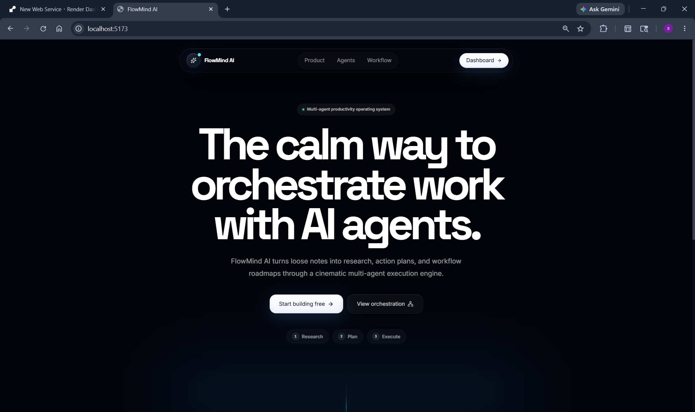
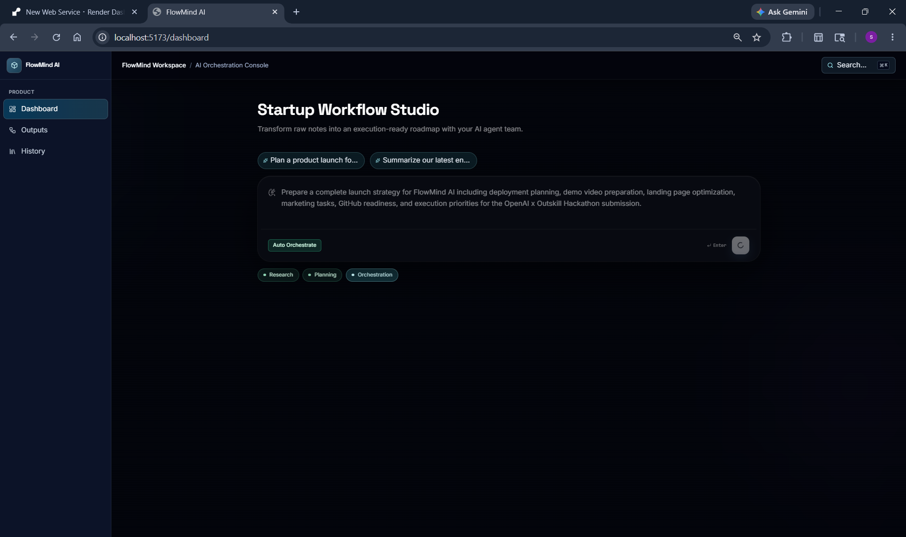
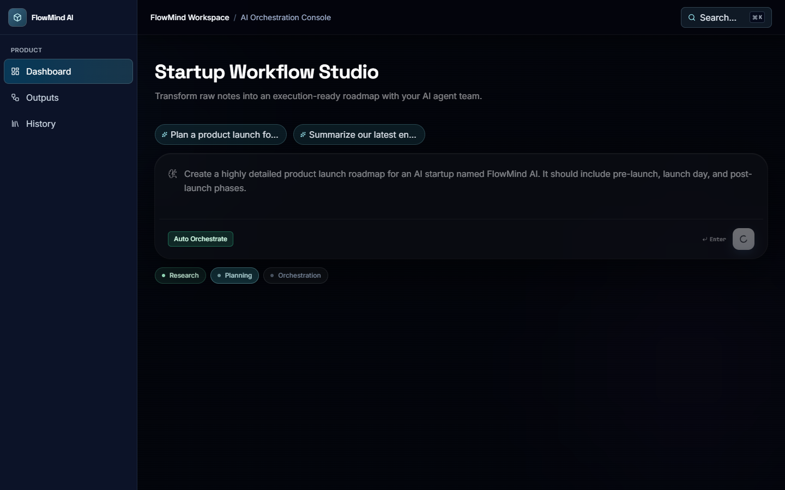
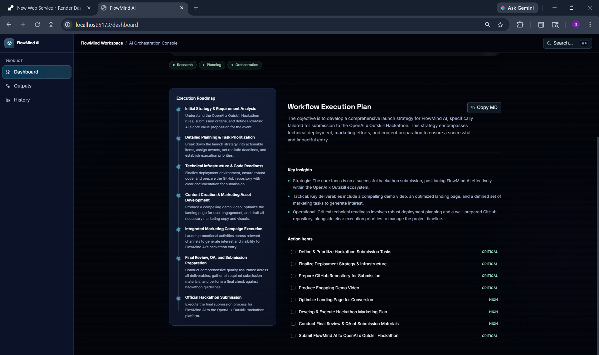
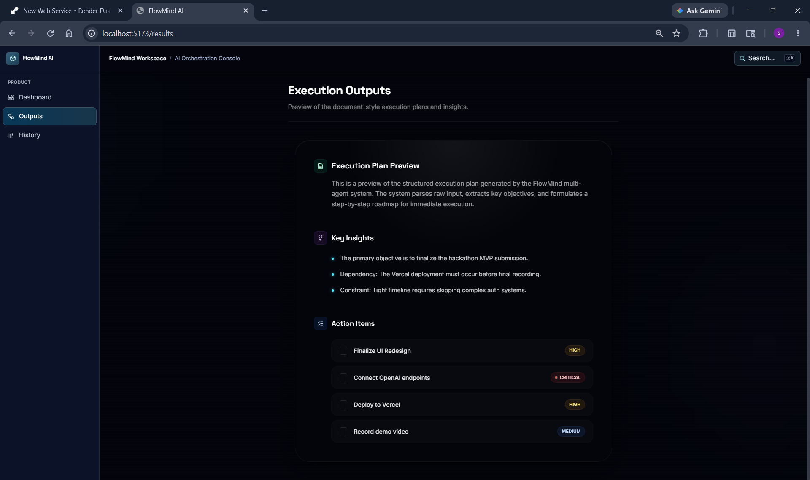

# FlowMind AI — The Execution Operating System

**An AI-powered multi-agent execution engine built for the OpenAI x Outskill AI Builders Hackathon.**



> *"Most AI tools generate information. FlowMind AI generates execution."*

---

## 🚀 Product Vision

FlowMind AI is not a chatbot, a prompt wrapper, or a generic AI assistant. It is a premium **operational execution engine** and **workflow orchestration platform**. 

We believe the future of AI in the workplace isn't just about answering questions—it's about coordinating complex execution. We built FlowMind AI to bridge the massive gap between thinking, planning, and doing.

## ⚠️ The Problem Statement

Builders, founders, students, and professionals suffer from **execution overload**. 

You don't need more unstructured text. You don't need another generic chat interface to read through. Current AI tools often exacerbate fragmented operational systems by returning long walls of text that still require manual structuring, prioritizing, and planning before any real work can begin.

## 💡 The Solution

FlowMind AI transforms raw intent—messy notes, meeting transcripts, and brainstorms—into structured execution plans. 

Instead of returning text, FlowMind AI generates an **execution ecosystem**. Through coordinated multi-agent orchestration, the platform extracts insights, establishes priorities, and builds a comprehensive workflow pipeline that you can act on immediately.

---

## ✨ Key Features

- **Multi-Agent Orchestration Pipelines:** Watch specialized AI agents collaborate to process, refine, and structure your goals.
- **Execution Phases & Priority Systems:** Workflows are automatically categorized by phase, effort, and priority.
- **Structured Outputs:** Results are generated as operational JSON payloads, rendered beautifully in a cinematic interface.
- **Premium Export System:** Seamlessly export execution roadmaps to Markdown or TXT for presentation-ready, consultant-grade documents.
- **Workflow Intelligence:** Automated insight extraction and dependency mapping.

---

## 🧠 Multi-Agent Architecture

FlowMind AI utilizes a specialized multi-agent pipeline to ensure the highest-quality execution generation:

1. **Research Agent:** Extracts core constraints, dependencies, and objectives from raw, messy inputs.
2. **Planner Agent:** Structures the extracted data into an actionable execution timeline.
3. **Operations Agent:** Manages the presentation and formatting of the operational roadmap (re-branded in UI as Productivity Agent).
4. **Summary Agent:** Distills complex workflows into immediate, high-level insights.
5. **Workflow Engine:** Orchestrates the seamless handoff of state, context, and JSON payloads between all agents in the pipeline.

## 🔄 Workflow Pipeline

```text
Information Overload -> [ Research Agent ] -> [ Planner Agent ] -> [ Workflow Engine ] -> Execution Clarity
```

1. **Input:** Users drop raw, unstructured thoughts into the command workspace.
2. **Orchestration:** The AI agents process the input sequentially.
3. **Output:** A structured, startup-grade execution roadmap is instantly rendered.

---

## 🛠 Tech Stack

**Frontend**
- React + Vite
- Tailwind CSS (Premium Glassmorphism & SaaS Styling)
- Framer Motion (Subtle, cinematic micro-animations)

**Backend**
- Python + Flask
- Flask-CORS

**AI Execution Engine**
- Google Gemini (Multi-Agent Structured Generation)

**Infrastructure & Deployment**
- Vercel (Frontend)
- Render (Backend Engine)
- Supabase (Persistence Layer)

---

## 📸 Platform Showcase

### The Dashboard Experience
*The command center for execution generation.*


### Multi-Agent Execution Pipeline
*Visible AI orchestration and agent handoffs.*


### Structured Execution Outputs
*Consultant-grade, structured action plans ready for export.*


### Operational Export System
*Seamless TXT and Markdown export systems for presentation-ready documents.*


---

## 🎬 Demo Flow

FlowMind AI is designed to wow within the first 30 seconds:

1. **The Messy Input:** Paste a scattered, unstructured brain-dump into the sleek command terminal.
2. **The Orchestration:** Watch the premium timeline UI as the Research Agent and Planner Agent coordinate in real-time.
3. **The Execution:** Receive a fully structured, operational workflow roadmap divided into clear execution phases.
4. **The Export:** Click "Export TXT" to instantly download a presentation-ready project plan.

---

## ☁️ Deployment Configuration

FlowMind AI is production-ready and deployed using modern cloud infrastructure:

- **Frontend Configuration:** Vercel automatically deploys the Vite application, with environment variables securely routing API calls to the live backend.
- **Backend Configuration:** Render manages the Gunicorn WSGI server via a `render.yaml` blueprint, securely handling `CORS_ORIGINS` and `GEMINI_API_KEY` through the dashboard.

---

## 🔮 Future Vision

This MVP is the foundation of a comprehensive **AI Workflow Operating System**. 
Future iterations will introduce:
- Seamless integrations with Linear, Jira, and Notion.
- Persistent workflow memory and autonomous execution agents.
- Multi-user collaborative workspaces for enterprise teams.

FlowMind AI isn't just a hackathon project—it's the beginning of an execution revolution.
