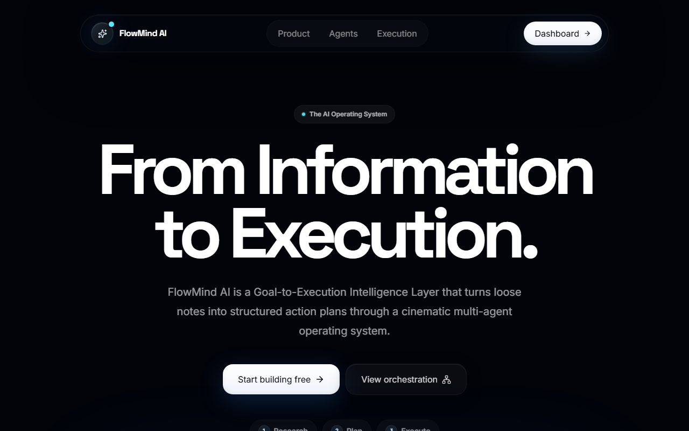
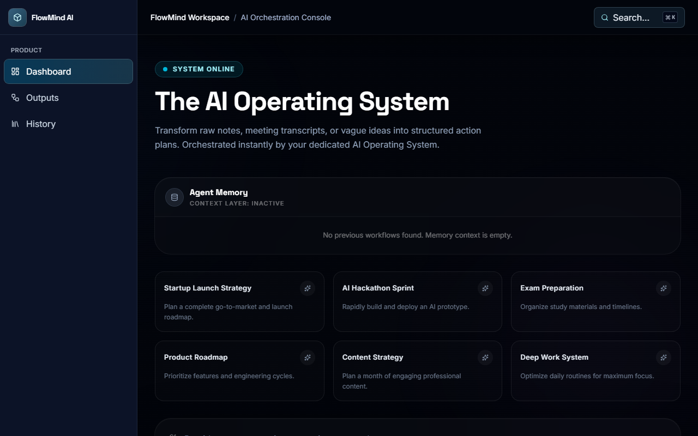
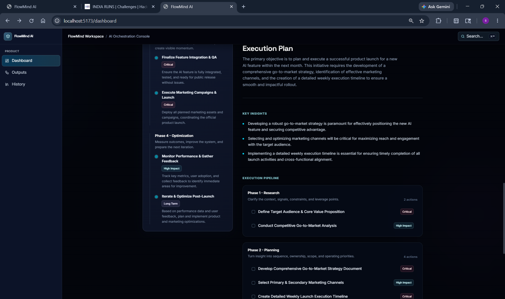
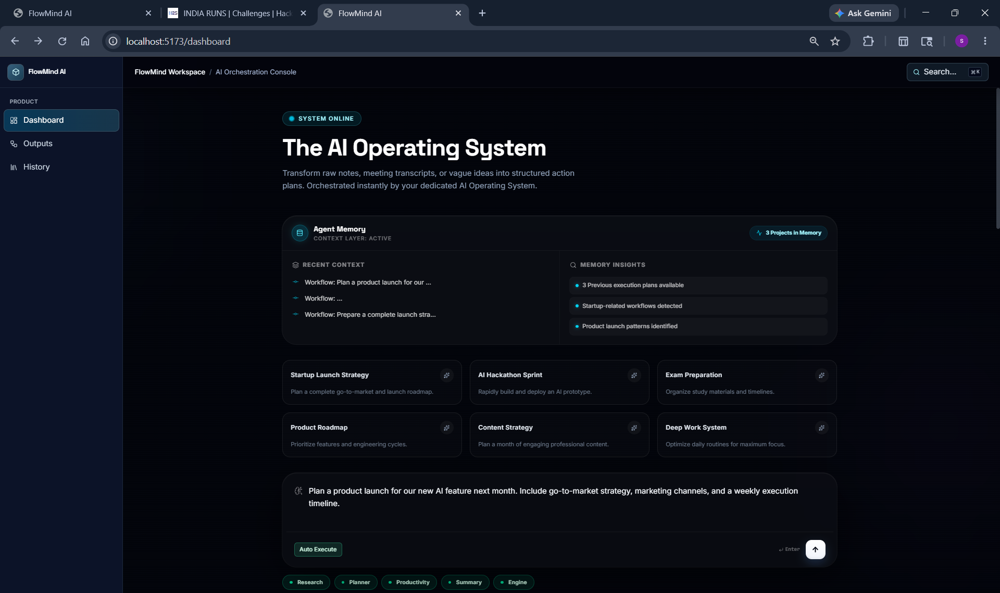
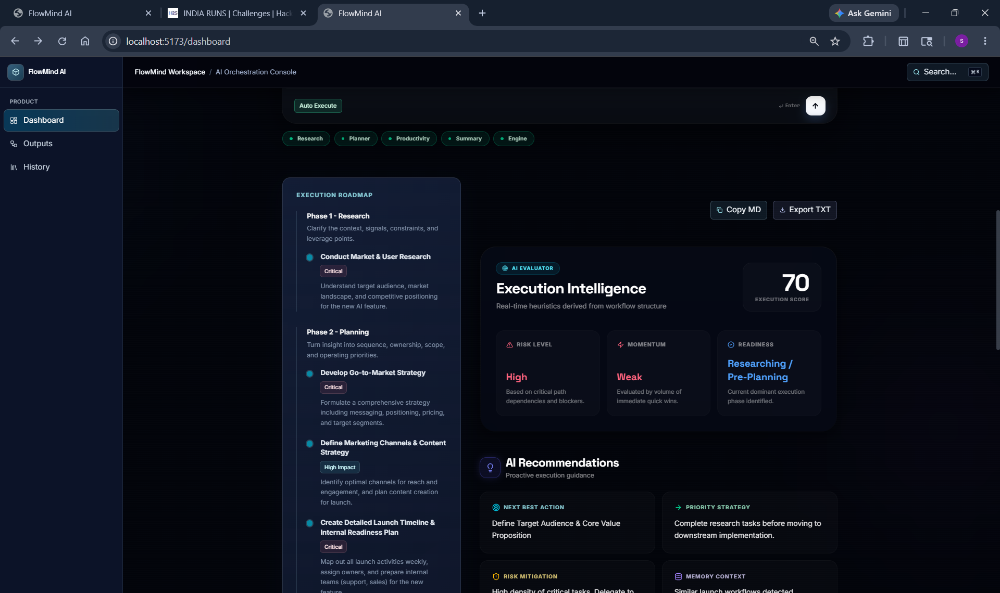
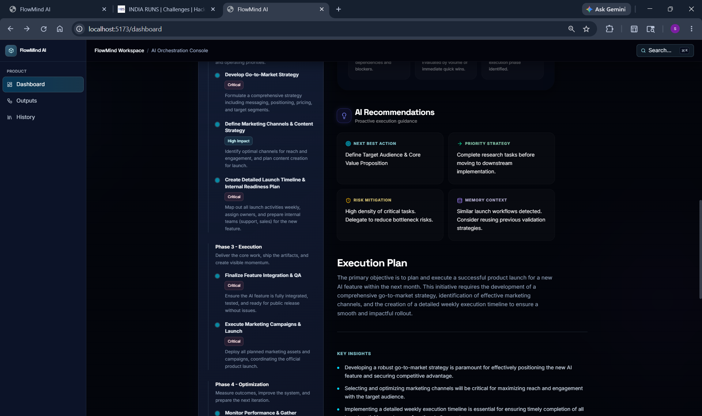

# FlowMind AI 2.0 — The AI Operating System

**An AI-powered multi-agent execution engine built for the India Runs Ideathon 2026 — Track 1: The AI Systems Architect: Reimagining Work.**



> *"Most AI tools generate information. FlowMind AI generates execution."*

---

## 🚀 Product Vision

FlowMind AI 2.0 is not a chatbot, a prompt wrapper, or a generic AI assistant. It is a premium **AI Operating System** and **Multi-Agent Execution Platform**.

We believe the future of AI in the workplace isn't just about answering questions — it's about coordinating complex execution. We built FlowMind AI 2.0 to bridge the massive gap between thinking, planning, and doing.

## ⚠️ The Problem Statement

Builders, founders, students, and professionals suffer from **execution overload**.

You don't need more unstructured text. You don't need another generic chat interface to read through. Current AI tools often exacerbate fragmented operational systems by returning long walls of text that still require manual structuring, prioritizing, and planning before any real work can begin.

## 💡 The Solution

FlowMind AI 2.0 is a Goal-to-Execution Intelligence Layer that transforms raw intent — messy notes, meeting transcripts, and brainstorms — into structured action plans.

Instead of returning text, FlowMind AI generates an **execution ecosystem**. Through coordinated multi-agent orchestration powered by Google Gemini, the platform extracts insights, establishes priorities, and builds a comprehensive execution plan that you can act on immediately.

---

## ✨ Key Features

- **Multi-Agent Orchestration Pipeline:** Specialized AI agents collaborate sequentially to process, refine, and structure your goals into an execution roadmap.
- **Execution Phases & Priority Systems:** Workflows are automatically categorized across four phases (Research → Planning → Execution → Optimization) with intelligent priority assignment.
- **Structured JSON Outputs:** Results are generated as operational JSON payloads, rendered beautifully in a cinematic dashboard interface.
- **Agent Memory Layer:** Historical workflow context is surfaced through Supabase persistence, enabling informed future generation.
- **Execution Intelligence Dashboard:** Real-time heuristic scoring across Risk Level, Momentum, and Execution Readiness.
- **AI Recommendations Engine:** Contextual, proactive guidance — Next Best Action, Priority Strategy, Risk Mitigation, and Memory Context.
- **Premium Export System:** Export execution roadmaps to Markdown (clipboard) or TXT for presentation-ready, consultant-grade documents.
- **Workflow History:** Full chronological archive of all generated execution plans, persisted via Supabase.

---

## 🧠 Multi-Agent Architecture

FlowMind AI 2.0 uses a specialized multi-agent pipeline to ensure the highest-quality execution generation:

1. **Research Agent:** Extracts core constraints, dependencies, key insights, and strategic opportunities from raw, messy user input. Powered by Gemini with structured JSON output.
2. **Planner Agent:** Receives the research output and original text, then synthesizes a prioritized execution plan with action items, workflow steps, owners, and effort estimates. Powered by Gemini with structured JSON output.
3. **Workflow Engine:** Orchestrates the sequential handoff of state, context, and JSON payloads between agents. Applies intelligent priority normalization and phase classification to guarantee output consistency.

## 🔄 Execution Pipeline

```text
Raw Input → [ Research Agent ] → [ Planner Agent ] → [ Workflow Engine ] → Structured Execution Plan
```

1. **Input:** Paste raw, unstructured notes, meeting transcripts, or goals into the command workspace.
2. **Research:** The Research Agent extracts summary, key insights, constraints, and opportunities.
3. **Planning:** The Planner Agent synthesizes action items and workflow steps with phases and priorities.
4. **Orchestration:** The Workflow Engine normalizes and structures the unified response.
5. **Output:** A categorized execution plan is rendered with intelligence scoring and AI recommendations.

---

## 🛠 Tech Stack

**Frontend**
- React + Vite
- Tailwind CSS (Premium Glassmorphism & SaaS Styling)
- Framer Motion (Cinematic micro-animations)
- Supabase JS Client (Anonymous Auth + Workflow Persistence)

**Backend**
- Python + Flask
- Flask-CORS
- Gunicorn (Production WSGI)

**AI Execution Engine**
- Google Gemini (Multi-Agent Structured Generation via `response_mime_type="application/json"`)

**Infrastructure & Deployment**
- Vercel (Frontend)
- Render (Backend Engine)
- Supabase (Authentication & Persistence Layer)

---

## 📸 Platform Showcase

### The Landing Page
*Premium marketing experience with multi-agent orchestration visualization.*


### The Dashboard Experience
*The command center for execution generation.*


### Multi-Agent Workflow Generation
*Visible AI orchestration with live terminal and agent status indicators.*


### Agent Memory Layer
*Historical workflow context surfaced for informed generation.*


### Execution Intelligence Dashboard
*Real-time heuristic scoring: Risk Level, Momentum, and Execution Readiness.*


### AI Recommendations Engine
*Proactive execution guidance: Next Best Action, Priority Strategy, Risk Mitigation.*


---

## 🎬 Demo Flow

FlowMind AI 2.0 is designed to deliver value within the first 30 seconds:

1. **The Messy Input:** Paste a scattered, unstructured brain-dump into the sleek command terminal.
2. **The Orchestration:** Watch the premium timeline UI and live terminal as the Research Agent and Planner Agent coordinate in real-time.
3. **The Execution:** Receive fully structured action plans divided into clear execution phases with priority labels.
4. **The Intelligence:** Review the Execution Score, Risk Level, Momentum, and AI Recommendations.
5. **The Export:** Click **Export TXT** or **Copy MD** to instantly download a presentation-ready project plan.

---

## 🚀 Local Setup

### Prerequisites
- Node.js 18+
- Python 3.11+
- A [Google Gemini API key](https://aistudio.google.com/app/apikey)
- A [Supabase](https://supabase.com) project (optional — app runs without persistence)

### Backend

```bash
cd backend
python -m venv .venv

# Windows
.venv\Scripts\activate

# macOS / Linux
source .venv/bin/activate

pip install -r requirements.txt

cp .env.example .env
# Edit .env and add your GEMINI_API_KEY

python run.py
# Backend runs at http://localhost:5000
```

### Frontend

```bash
cd frontend
npm install

cp .env.example .env
# Edit .env:
# VITE_API_URL=http://localhost:5000
# VITE_SUPABASE_URL=your_supabase_url (optional)
# VITE_SUPABASE_ANON_KEY=your_supabase_anon_key (optional)

npm run dev
# Frontend runs at http://localhost:5173
```

---

## ☁️ Deployment Configuration

FlowMind AI 2.0 is production-ready and deployed using modern cloud infrastructure:

### Backend — Render

Configured via `render.yaml`. Set these environment variables in the Render dashboard:

```text
GEMINI_API_KEY=your_gemini_api_key
SECRET_KEY=a-long-random-secret-string
FLASK_ENV=production
FLASK_DEBUG=false
FRONTEND_URL=https://your-flowmind-frontend.vercel.app
CORS_ORIGINS=https://your-flowmind-frontend.vercel.app
```

### Frontend — Vercel

Configured via `frontend/vercel.json`. Set these environment variables in the Vercel dashboard:

```text
VITE_API_URL=https://your-flowmind-backend.onrender.com
VITE_SUPABASE_URL=your_supabase_project_url
VITE_SUPABASE_ANON_KEY=your_supabase_anon_key
```

### Recommended Deployment Order

1. Deploy backend to Render. Confirm `/health` returns `status: healthy`.
2. Copy the Render URL. Set `VITE_API_URL` in Vercel.
3. Deploy frontend to Vercel.
4. Copy the Vercel URL. Update `FRONTEND_URL` and `CORS_ORIGINS` in Render.
5. Redeploy backend. Test full workflow end-to-end from the public Vercel URL.

---

## 🔮 Future Vision

FlowMind AI 2.0 is the foundation of a comprehensive **AI Operating System**.
Future iterations will introduce:
- Seamless integrations with Linear, Jira, Notion, and Slack.
- Persistent workflow memory with vector search and pattern recognition.
- Multi-user collaborative workspaces for enterprise teams.
- File upload support for documents and meeting recordings.

FlowMind AI 2.0 isn't just a hackathon project — it's the beginning of an execution revolution.

---

*Built for **India Runs Ideathon 2026** — Track 1: The AI Systems Architect: Reimagining Work*
